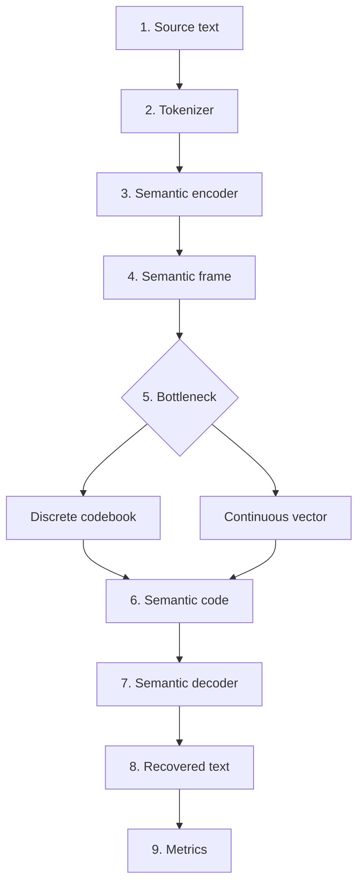

# Text Semantic Codec Core Method

This document explains how the text semantic communication prototype works.

## Goal

Traditional communication tries to reproduce the original bits exactly. Semantic communication tries to preserve the meaning that the receiver needs.

This prototype starts with text only:

```text
Original sentence -> compact semantic code -> recovered sentence
```

The recovered sentence does not need to match the original word by word. It should preserve the essential meaning.

## Core Method Flow



| Step | What Happens | Example |
| --- | --- | --- |
| 1. Source text | Receive the original user sentence. | `The meeting has been postponed because of the heavy rain.` |
| 2. Tokenizer | Split text into normalized tokens. | `meeting`, `postponed`, `heavy`, `rain` |
| 3. Semantic encoder | Map tokens to meaning-bearing concepts. | `postponed -> delay` |
| 4. Semantic frame | Store concepts and semantic flags. | concepts: `meeting`, `delay`, `heavy`, `rain` |
| 5. Bottleneck | Compress meaning into a compact representation. | discrete or continuous |
| 6. Semantic code | Transmit compact semantic payload. | `[54, 16, 94, 197]` |
| 7. Semantic decoder | Reconstruct canonical meaning. | delay + rain -> delayed due to rain |
| 8. Recovered text | Produce a meaning-preserving sentence. | `The meeting was delayed due to heavy rain.` |
| 9. Metrics | Evaluate meaning and compression. | similarity, BLEU, ROUGE-L, compression ratio |

## Step-by-Step Explanation

### 1. Source Text

The user enters a sentence. The API receives it through:

```text
POST /api/semantic/convert
```

### 2. Tokenizer

The tokenizer extracts normalized English tokens:

```text
The meeting has been postponed because of the heavy rain.
```

becomes:

```text
["the", "meeting", "has", "been", "postponed", "because", "of", "the", "heavy", "rain"]
```

### 3. Semantic Encoder

The semantic encoder maps tokens into meaning-bearing concepts:

```text
meeting -> meeting
postponed -> delay
heavy -> heavy
rain -> rain
```

The result is a semantic frame:

```text
concepts = ["meeting", "delay", "heavy", "rain"]
flags = {
  negation: false,
  time: false,
  quantity: false,
  location: false,
  intent: false
}
```

### 4. Semantic Bottleneck

The bottleneck compresses meaning into a compact representation.

Discrete mode:

```text
concepts -> codebook indexes -> [54, 16, 94, 197]
```

Continuous mode:

```text
concepts -> fixed-dimensional vector
```

The discrete prototype uses deterministic hashing as a stand-in for a learned codebook. This makes the prototype easy to inspect before training a neural model.

### 5. Semantic Decoder

The decoder reconstructs a sentence from the semantic frame:

```text
The meeting was delayed due to heavy rain.
```

This is not exact text recovery. It is meaning-preserving recovery.

### 6. Evaluation

The system evaluates both wording and meaning:

```text
exact_match = false
bleu = lower because wording changed
sentence_similarity = high because meaning is preserved
compression_ratio = semantic_code_bits / original_text_bits
semantic_efficiency = sentence_similarity / semantic_code_bits
```

## Why This Design

This prototype separates the research problem into replaceable blocks:

```text
Tokenizer -> Encoder -> Bottleneck -> Decoder -> Metrics
```

Each block can be upgraded independently:

- Rule-based encoder -> embedding encoder
- Hash codebook -> learned vector quantizer
- Rule-based decoder -> seq2seq decoder
- Direct transmission -> noisy channel simulation
- Simple similarity -> sentence-transformer or embedding similarity

## Current Implementation Files

```text
src/semantic_text_codec/models/tokenizer.py
src/semantic_text_codec/models/semantic_encoder.py
src/semantic_text_codec/models/discrete_codebook.py
src/semantic_text_codec/models/continuous_bottleneck.py
src/semantic_text_codec/models/semantic_decoder.py
src/semantic_text_codec/models/semantic_codec.py
src/semantic_text_codec/metrics/text_metrics.py
backend/main.py
frontend/src/main.ts
```

## Decision Use

Use this document to decide the next research direction:

1. If recovered meaning is too weak, improve the encoder/decoder first.
2. If compression is too large, improve the bottleneck.
3. If metrics disagree with human judgment, improve semantic similarity.
4. If web behavior is stable, add channel noise simulation.
